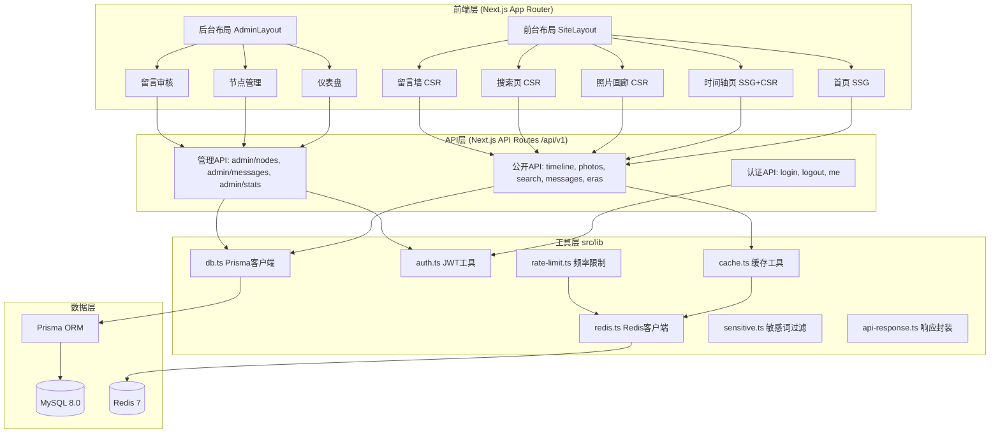

## 产品概述

毛主席生平纪念网站是一个以时间轴为主线、以100张珍贵历史照片为核心载体的公益性纪念网站。网站按照毛泽东主席一生从1918年到1965年的时间顺序，展示98个重要时间节点和重大事件，每个节点配以真实历史照片和详实文字说明。整体视觉风格庄重肃穆，采用红色与金色为主色调，体现红色文化特色。

## 核心功能

- **首页**：全屏英雄区（毛主席肖像+主题标语+进入入口）、简介统计区、6个年代导航卡、精选时间节点、留言预览
- **时间轴主视图（P0核心）**：垂直时间轴左右交替布局，98个节点带滚动入场动画，无限懒加载，年代快速筛选与进度指示器
- **节点详情弹窗**：大图展示+事件描述+历史背景，支持上/下节点切换、键盘快捷键、图片灯箱全屏模式
- **照片画廊**：响应式网格（PC 4列/手机 2列），年代筛选与排序，悬停遮罩
- **搜索功能**：关键词搜索（标题/描述/图片说明），实时搜索建议，搜索历史，结果高亮
- **纪念留言墙**：匿名留言提交（敏感词过滤+频率限制），瀑布流展示，点赞功能
- **后台管理**：管理员登录（JWT）、时间节点CRUD、留言审核、敏感词管理、数据统计面板、系统设置
- **全站响应式适配**：PC/平板/手机三端，移动端汉堡菜单与单列布局

## 技术栈选择

本项目为全新项目，技术栈严格遵循文档规范：

### 前端

- **框架**：Next.js 14+（App Router），支持 SSG/SSR/CSR 混合渲染
- **语言**：TypeScript 5+
- **样式**：Tailwind CSS 3+（原子化CSS，自定义红金主题色板）
- **UI组件**：shadcn/ui（前台）+ Ant Design 5+（后台管理）
- **动画**：Framer Motion 11+（时间轴滚动动画、弹窗过渡、页面切换）
- **状态管理**：Zustand 4+（UI状态、认证状态、筛选状态）
- **数据请求**：SWR 2+（服务端数据缓存、无限滚动、自动重验证）
- **表单**：React Hook Form 7+ + Zod 3+（表单管理与Schema校验）
- **图标**：lucide-react

### 后端

- **运行时**：Node.js 18 LTS+
- **API**：Next.js API Routes（`/api/v1` 前缀）
- **ORM**：Prisma 5+（类型安全，完整Schema已在文档中定义）
- **数据库**：MySQL 8.0（utf8mb4，10张表，全文索引搜索）
- **缓存**：Redis 7+（热点数据缓存、频率限制、浏览量去重）
- **认证**：jsonwebtoken（JWT，HttpOnly Cookie）
- **加密**：bcryptjs（密码哈希）
- **图片处理**：sharp（缩略图生成、格式转换）

### 工具链

- ESLint + Prettier + Husky + lint-staged + commitlint
- Vitest（单元测试）+ Playwright（E2E测试）
- Docker + Docker Compose（MySQL + Redis + Web + Nginx）

## 实现方案

### 整体策略

采用**前后端一体化开发**模式（Next.js全栈），按"P0核心功能优先"原则分阶段交付。利用 Next.js App Router 的 Server Components 实现首页/时间轴的 SSG 静态生成以保证首屏性能，详情弹窗和后台管理采用 CSR 客户端交互。数据层通过 Prisma 直连 MySQL，Redis 用于缓存热点查询和实现频率限制。

### 关键技术决策

1. **渲染策略**：首页SSG（静态生成，构建时预取精选节点和年代数据）；时间轴页SSG+CSR（首屏静态+无限滚动动态加载）；节点详情弹窗纯CSR（按需请求）；后台管理纯CSR
2. **无限滚动**：使用 SWR 的 `useSWRInfinite` 实现时间轴节点的分页懒加载，配合 Intersection Observer 触发加载，每次加载10个节点
3. **搜索实现**：MySQL FULLTEXT 索引（ngram 分词器）支持中文全文搜索，搜索建议使用 Redis 缓存热门关键词
4. **图片优化**：Next.js Image 组件自动响应式加载，外部 cctvpic.com 图片需配置 `next.config.js` 的 `remotePatterns`；生产环境建议下载到本地/OSS并用 sharp 生成多尺寸缩略图
5. **留言安全**：敏感词过滤采用 Trie 树算法，level=2 直接拒绝，level=1 替换为`*`；频率限制基于 Redis 计数器（IP维度，每小时5条）
6. **认证方案**：JWT 通过 HttpOnly Cookie 传递，middleware.ts 拦截 `/admin/*` 路由验证 Token，5次密码错误锁定30分钟

### 性能考量

- 首屏FCP ≤ 2s：SSG预渲染 + 关键CSS内联 + 图片懒加载
- 时间轴滚动60fps：Framer Motion 使用 `transform` 动画属性，避免触发布局重排；Intersection Observer 的 `once: true` 避免重复触发
- API响应P95 ≤ 500ms：Redis缓存时间轴列表（TTL 5分钟），分页查询走索引
- 避免N+1查询：Prisma `include` 预加载关联照片和标签

## 架构设计



## 目录结构

```
mao-memorial/
├── docs/                                    # [已有] 项目文档（12个md文件）
├── prisma/
│   ├── schema.prisma                        # [NEW] Prisma Schema（10个模型，文档已定义完整Schema）
│   ├── seed.ts                              # [NEW] 种子数据脚本（年代分类、管理员、系统设置、敏感词）
│   └── import-timeline.ts                   # [NEW] 98个时间节点+100张照片数据导入脚本
├── public/
│   ├── images/hero/                         # [NEW] 首页英雄区图片
│   ├── images/portraits/                    # [NEW] 毛主席肖像
│   ├── fonts/                               # [NEW] Noto Serif SC / Noto Sans SC 字体
│   ├── favicon.ico                          # [NEW]
│   └── robots.txt                           # [NEW]
├── src/
│   ├── app/
│   │   ├── (site)/                          # [NEW] 前台路由组
│   │   │   ├── layout.tsx                   # 前台布局（Header + Footer）
│   │   │   ├── page.tsx                     # 首页（SSG）
│   │   │   ├── timeline/page.tsx            # 时间轴页（SSG+CSR无限滚动）
│   │   │   ├── gallery/page.tsx             # 照片画廊页
│   │   │   ├── search/page.tsx              # 搜索结果页
│   │   │   ├── messages/page.tsx            # 留言墙页
│   │   │   └── about/page.tsx              # 关于页
│   │   ├── admin/                           # [NEW] 后台路由
│   │   │   ├── layout.tsx                   # 后台布局（Sidebar + Header + Guard）
│   │   │   ├── login/page.tsx               # 登录页
│   │   │   ├── dashboard/page.tsx           # 仪表盘
│   │   │   ├── nodes/                       # 节点管理（列表/新增/编辑）
│   │   │   ├── messages/page.tsx            # 留言审核
│   │   │   ├── admins/page.tsx              # 管理员管理
│   │   │   ├── settings/page.tsx            # 系统设置
│   │   │   └── stats/page.tsx              # 数据统计
│   │   ├── api/v1/                          # [NEW] API路由（47个端点）
│   │   │   ├── timeline/                    # 时间轴API（列表/详情/相邻/浏览量/精选）
│   │   │   ├── photos/                      # 照片API（画廊/详情）
│   │   │   ├── search/                      # 搜索API（搜索/建议/热门）
│   │   │   ├── messages/                    # 留言API（列表/提交/点赞）
│   │   │   ├── auth/                        # 认证API（登录/退出/用户信息/改密）
│   │   │   ├── eras/route.ts                # 年代列表
│   │   │   ├── settings/route.ts            # 公开设置
│   │   │   ├── health/route.ts              # 健康检查
│   │   │   └── admin/                       # 后台管理API（nodes/messages/admins/sensitive-words/settings/upload/stats）
│   │   ├── layout.tsx                       # [NEW] 根布局
│   │   ├── loading.tsx                      # [NEW] 全局加载态
│   │   ├── error.tsx                        # [NEW] 全局错误边界
│   │   ├── not-found.tsx                    # [NEW] 404页面
│   │   └── globals.css                      # [NEW] 全局样式（Tailwind + CSS变量）
│   ├── components/
│   │   ├── site/                            # [NEW] 前台组件（SiteHeader, SiteFooter, HeroSection, EraNavigation, FeaturedTimeline, MessagePreview, SearchBar 等9个）
│   │   ├── timeline/                        # [NEW] 时间轴组件（TimelineContainer, TimelineNode, TimelineSkeleton, TimelineFilter, NodeDetailModal, ImageCarousel 等6个）
│   │   ├── gallery/                         # [NEW] 画廊组件（PhotoGallery, PhotoCard, GalleryFilter, Lightbox 等4个）
│   │   ├── message/                         # [NEW] 留言组件（MessageForm, MessageCard, MessageWall 等3个）
│   │   ├── admin/                           # [NEW] 后台组件（AdminLayout, AdminSidebar, AdminHeader, AdminGuard, DataTable, ImageUploader, NodeForm, StatCard, TrafficChart 等9个）
│   │   ├── common/                          # [NEW] 公共组件（Pagination, LoadingSpinner, EmptyState, ErrorBoundary, ScrollTrigger, ConfirmDialog, Toast, Image 等8个）
│   │   └── ui/                              # [NEW] shadcn/ui 组件（button, input, dialog, dropdown-menu 等）
│   ├── lib/                                 # [NEW] 工具库
│   │   ├── db.ts                            # Prisma客户端（全局单例）
│   │   ├── redis.ts                         # Redis客户端
│   │   ├── auth.ts                          # JWT认证工具（签发/验证/中间件）
│   │   ├── cache.ts                         # Redis缓存封装
│   │   ├── logger.ts                        # Winston日志
│   │   ├── upload.ts                        # 文件上传处理
│   │   ├── image.ts                         # sharp图片处理
│   │   ├── sensitive.ts                     # 敏感词Trie树过滤
│   │   ├── rate-limit.ts                    # Redis频率限制
│   │   ├── api-response.ts                  # 统一API响应封装
│   │   ├── validate.ts                      # Zod参数校验
│   │   └── utils.ts                         # 通用工具（cn等）
│   ├── hooks/                               # [NEW] 自定义Hooks（use-timeline, use-infinite-timeline, use-node-detail, use-search, use-messages, use-auth, use-debounce, use-in-view, use-keyboard, use-body-scroll-lock, use-media-query）
│   ├── stores/                              # [NEW] Zustand Store（ui-store, auth-store, timeline-store）
│   ├── types/                               # [NEW] TypeScript类型（api.ts, timeline.ts, message.ts, admin.ts）
│   ├── constants/                           # [NEW] 常量（eras.ts, cache-keys.ts, error-codes.ts, config.ts）
│   └── middleware.ts                        # [NEW] Next.js中间件（后台路由认证拦截）
├── tests/                                   # [NEW] 测试文件（unit/ integration/ e2e/）
├── scripts/                                 # [NEW] 脚本（generate-sitemap.ts, clear-cache.ts, backup-db.ts）
├── .env.example                             # [NEW] 环境变量示例
├── .eslintrc.json                           # [NEW] ESLint配置
├── .prettierrc                              # [NEW] Prettier配置
├── next.config.js                           # [NEW] Next.js配置（图片域名、输出模式）
├── tailwind.config.ts                       # [NEW] Tailwind配置（自定义颜色/字体/动画）
├── tsconfig.json                            # [NEW] TypeScript配置
├── package.json                             # [NEW] 依赖与脚本
├── Dockerfile                               # [NEW] 多阶段Docker构建
├── docker-compose.yml                       # [NEW] MySQL+Redis+Web+Nginx
└── nginx.conf                               # [NEW] Nginx反向代理配置
```

## 实现要点

### 数据库与数据导入

- Prisma Schema 严格按 `04-数据库表设计.md` 中的定义实现，10个模型含完整索引和关系
- `prisma/seed.ts` 导入6个年代分类、2个管理员账号、11条系统设置、基础敏感词
- `prisma/import-timeline.ts` 从 `09-时间线数据.md` 解析98个节点和100张照片，注意节点1和节点2的顺序需按 date_sort 排序（1918年3月在1919年之前）
- 时间线数据中的照片说明文字（caption）与实际图片内容存在错位问题（源数据问题），导入时以节点标题和描述为准

### API响应规范

- 统一使用 `api-response.ts` 封装：`{ code, message, data, timestamp, requestId }`
- 分页响应统一结构：`{ items, total, page, pageSize, totalPages }`
- 错误处理：Zod校验失败返回400+errors数组，未认证返回401，权限不足返回403，频率超限返回429

### 前端关键实现

- `next.config.js` 需配置 `images.remotePatterns` 允许 `*.img.cctvpic.com` 域名
- 时间轴节点交替布局：`index % 2 === 0` 左侧，否则右侧；移动端统一左侧
- NodeDetailModal 需实现：ESC关闭、左右箭头切换、背景滚动锁定（`use-body-scroll-lock`）、焦点陷阱
- Lightbox 需实现：滚轮缩放（1x-4x）、拖动平移、双击复位、键盘导航
- SWR无限滚动：`useSWRInfinite` 配合 `ScrollTrigger` 组件，`revalidateFirstPage: false` 避免重复请求

### 安全与性能

- middleware.ts 拦截 `/admin/*`（排除`/admin/login`），验证JWT Token
- 留言提交：敏感词Trie树过滤 → Redis频率限制（IP+1小时窗口） → 入库待审核
- 浏览量统计：Redis SET 去重（`node:{id}:views:{ip}`，TTL 1小时），定期同步到MySQL
- Redis缓存：时间轴列表缓存5分钟，年代列表缓存1小时，搜索建议缓存10分钟

## 设计风格

采用**庄重肃穆的红色文化主题**，融合现代Web设计美学。以深红色（#8B0000）为主色调、金色（#D4AF37）为强调色，搭配深色背景营造历史厚重感。使用毛玻璃效果（backdrop-blur）的固定导航栏、Framer Motion 滚动入场动画、金色光晕节点标记点等细节提升沉浸感。整体风格介于 Material Design 的层次感与 Glassmorphism 的通透感之间，以红色文化为内核。

## 页面规划（6个核心页面）

### 页面1：首页

- **英雄区**：全屏100vh，深红渐变背景（#8B0000→#2F0000），居中毛主席肖像带柔和光晕，主标题"永远的怀念"淡入动画，"进入时间轴"金色引导按钮
- **简介统计区**：毛泽东同志生平简介文字 + 4个统计数字卡片（100张照片/6个年代/48年历程/1918-1965）
- **年代导航区**：6个年代卡片横向排列，每个卡片含年代名称、时间范围、主题色、图标，点击跳转时间轴对应位置
- **精选时间轴区**：4-6个精选节点卡片，含缩略图+日期+标题，横向排列，点击打开详情弹窗
- **留言预览区**：3条最新留言卡片 + "查看全部"链接

### 页面2：时间轴页

- **头部区**：标题"生平时间轴" + 6个年代筛选标签（横向可滚动，选中金色高亮）
- **时间轴主体**：中央红色渐变垂直主线，节点左右交替排列，金色圆形标记点带光晕动画；每个节点卡片含缩略图、日期（金色大字）、标题、描述、"查看详情"按钮
- **滚动加载区**：底部骨架屏 + Intersection Observer 触发加载
- **进度指示器**：右侧固定垂直进度条，显示当前年份和百分比（PC端）

### 页面3：节点详情弹窗

- **顶部导航栏**：上一个/下一个按钮 + 日期 + 关闭按钮
- **图片展示区**：大图居中（max-height 500px），支持点击进入灯箱，多图时显示轮播指示器（1/2）
- **信息区**：标题（大号白色）、年代标签、事件描述、历史背景分隔区
- **底部统计**：浏览量、点赞数

### 页面4：照片画廊页

- **筛选栏**：年代标签 + 排序下拉 + 搜索框
- **网格区**：响应式网格（PC 4列/平板 3列/手机 2列），正方形缩略图，悬停显示半透明遮罩+年份+说明
- **加载更多**：瀑布流懒加载按钮

### 页面5：留言墙页

- **留言表单**：昵称输入框（选填）+ 留言文本域（200字限制+字数统计）+ 提交按钮
- **留言列表**：卡片瀑布流（PC 3列/手机 1列），每条含昵称、内容、时间、点赞按钮，置顶留言优先

### 页面6：后台管理

- **侧边栏**：固定左侧，含仪表盘/节点管理/留言审核/数据统计/系统设置菜单项
- **仪表盘**：4个统计卡片 + 访问趋势折线图 + 热门节点TOP10 + 待审核留言快速操作
- **节点管理**：数据表格（日期/标题/年代/状态/操作）+ 分页 + 搜索筛选 + 新增/编辑表单（含图片上传器）

## Agent Extensions

### Skill

- **playwright-cli**
- Purpose: 在测试阶段执行E2E自动化测试，验证时间轴滚动、节点详情弹窗、留言提交、后台管理等核心交互流程
- Expected outcome: 生成E2E测试报告，确保所有核心用户流程在真实浏览器环境中正常运行，覆盖PC和移动端视口